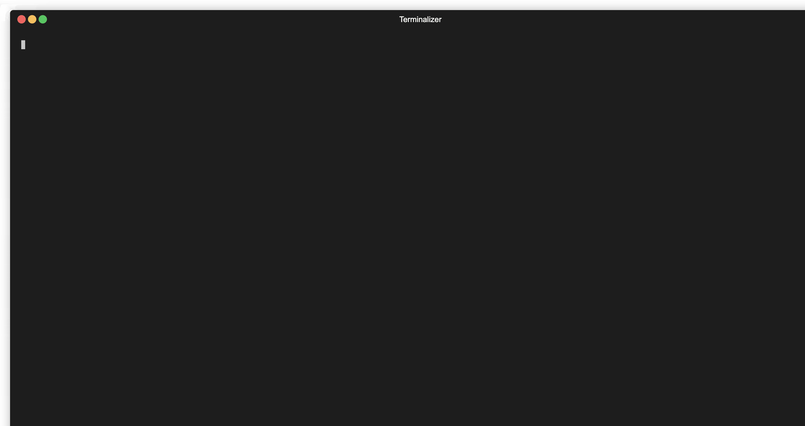

# AWS Service Limits

This tool fetches and displays service quotas for AWS services. It uses the [GetAWSDefaultServiceQuota](https://docs.aws.amazon.com/servicequotas/2019-06-24/apireference/API_GetAWSDefaultServiceQuota.html) API to retrieve information about the current setting and utilizes the UsageMetric information to get the actual usage via CloudWatch.



## Features

- Query AWS service quotas and their current usage via Cloudwatchnpm install -g terminalizer
- Supports multiple output formats including tables, CSV, Markdown, and JSON.
- Can exclude items with a usage value of "Not Available".
- Lists all AWS services supported by the AWS Service Quota API.
- Color-coded display to easily spot "Not Available" usages.

## Installation

```bash
curl -L -o aws-service-limits https://github.com/sjramblings/aws-service-limits/releases/download/v0.1.0/aws-service-limits.linux-amd64

```

## Basic Usage

Fetch and display AWS service quotas for EC2

```bash
$ aws-service-limits 
Completed 111/112 tasks
All tasks completed!
Account ID   Region          Service              Global Value           Usage           Quota Name                                                                      
123456789012 ap-southeast-2  ec2                  false  1000            Not Available   AMI sharing                                                                     
123456789012 ap-southeast-2  ec2                  false  50000           Not Available   AMIs                                                                            
123456789012 ap-southeast-2  ec2                  false  96              0               All DL Spot Instance Requests                                                   
123456789012 ap-southeast-2  ec2                  false  128             0               All F Spot Instance Requests                                                    
123456789012 ap-southeast-2  ec2                  false  64              0               All G and VT Spot Instance Requests                                             
123456789012 ap-southeast-2  ec2                  false  64              0               All Inf Spot Instance Requests                                                  
123456789012 ap-southeast-2  ec2                  false  64              0               All P Spot Instance Requests                                                    
.....          
```

Fetch and display AWS service quotas for a specific AWS service (e.g., Lambda):

```bash
$ aws-service-limits --servicecode lambda
Completed 0/2 tasks
All tasks completed!
Account ID   Region          Service              Global Value           Usage           Quota Name                                                                      
154145869091 ap-southeast-2  lambda               false  1000            0               Concurrent executions                                                           
154145869091 ap-southeast-2  lambda               false  75 Gigabytes    Not Available   Function and layer storage    
```

List all the services supported by the AWS Service Quota API:

```bash
$ aws-service-limits --list-services
AWS Amplify (amplify)
AWS App Mesh (appmesh)
AWS App Runner (apprunner)
AWS AppConfig (appconfig)
AWS AppSync (appsync)
AWS Application Discovery Service (discovery)
.......
```

Output to CSV

```bash
$ aws-service-limits --servicecode lambda -format csv
Completed 1/2 tasks
All tasks completed!
Account ID,Region,Service Code,Quota Name,Value,Usage,Global
154145869091,ap-southeast-2,lambda,Concurrent executions,1000,0,false
154145869091,ap-southeast-2,lambda,Function and layer storage,75 Gigabytes,Not Available,false
```

Output to Markdown

```bash
$ aws-service-limits --servicecode lambda -format markdown
Completed 1/2 tasks
All tasks completed!
| Account ID | Region | Service Code | Global | Value | Usage | Quota Name |
|------------|--------|--------------|-------|-------|-------|------------|
| 154145869091 | ap-southeast-2 | lambda | false | 1000 | 0 | Concurrent executions |
| 154145869091 | ap-southeast-2 | lambda | false | 75 Gigabytes | Not Available | Function and layer storage |
```

## Commandline Flags

```bash
--timeframe: Timeframe for the CloudWatch query in hours. Options: 1, 24, 48, 72, etc. Default is 1 hour.
--servicecode: The AWS Service Code to query. Default is 'ec2'.
--format: Output format. Options: table (default), csv, markdown, json.
--exclude-na: Exclude items with a usage value of 'Not Available'.
--list-services: List all the services supported by the AWS Service Quota API and exit.
```

## Contributing

Feel free to open issues or PRs if you find any issues or have feature requests.
